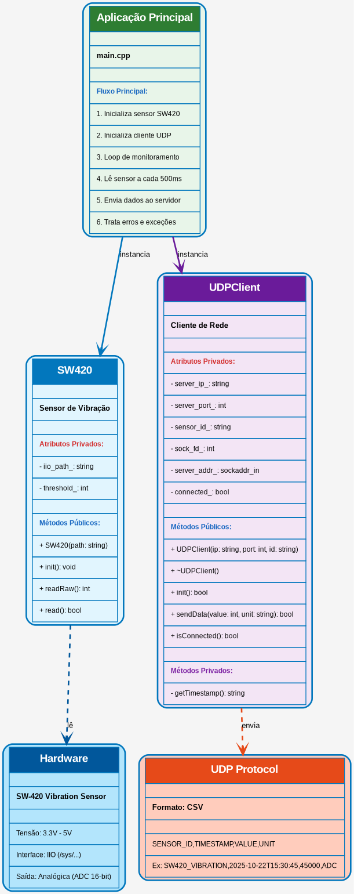
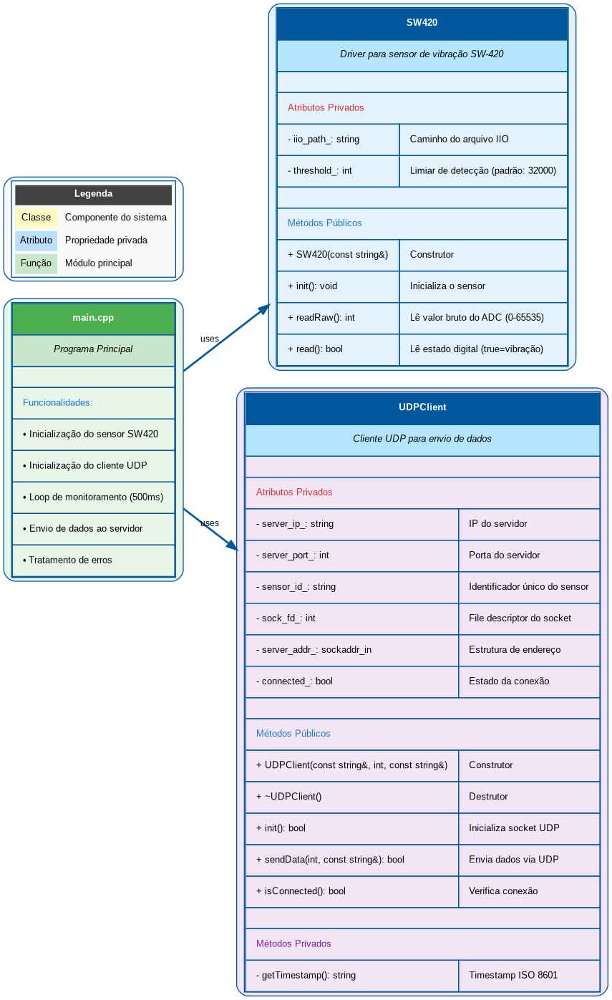

# Monitor de Vibração STM32MP1 – Sensor SW-420

O **Monitor de Vibração STM32MP1** é um sistema embarcado desenvolvido para detectar e reportar vibrações em tempo real utilizando o sensor **SW-420**, integrado ao kit **STM32MP1-DK1**.  
O objetivo é simples, mas essencial: transformar sinais físicos de vibração em informações claras, enviadas automaticamente a um servidor via **UDP**.  

Este projeto une hardware, software embarcado e comunicação em rede, mostrando na prática como construir um sistema completo de aquisição e transmissão de dados.

---

## O Sensor SW-420 e o Kit STM32MP1

O **SW-420** é um sensor de vibração sensível a movimentos bruscos ou oscilações mecânicas. Ele utiliza uma pequena esfera condutora que, ao se mover, altera o estado elétrico do circuito interno.  
No projeto, o sensor é alimentado a **3.3V** para garantir compatibilidade com o kit **STM32MP1-DK1**, que roda um sistema Linux embarcado com suporte à interface **IIO (Industrial I/O)**.  

**Principais características do SW-420:**
- Alimentação: 3.3V – 5V (usado em 3.3V no projeto)
- Saída analógica proporcional à intensidade da vibração
- Compatível com leitura via canal ADC (`in_voltageX_raw`)

---

## Arquitetura do Sistema

O sistema é dividido em três partes principais: o **sensor de vibração**, o **software embarcado** e o **servidor remoto** que recebe os dados.



1. O sensor SW-420 envia sinais analógicos ao ADC do STM32MP1.  
2. O software embarcado lê os valores por meio da interface IIO.  
3. As leituras são convertidas em dados e enviadas via UDP a um servidor remoto.  
4. O servidor (como o *Vibration Monitor GUI* em Python) exibe as informações em tempo real.

---

## Contexto Acadêmico

Este projeto foi desenvolvido como parte da disciplina **Programação Aplicada** do **Instituto Militar de Engenharia (IME)**.  
Dentro do escopo do projeto **Monitoramento Inteligente de Carga**, o sistema tem como meta identificar **movimentações indevidas, impactos ou tentativas de violação** de cargas sensíveis durante o transporte.  

A proposta é simples: aplicar conceitos de sistemas embarcados e redes para desenvolver uma solução funcional e didática.

---

## Estrutura do Código-Fonte

O projeto é organizado de forma modular, permitindo manutenção e expansão futura.

```
Vibration-Monitor-STM32/
├── src/
│   ├── sw420.h / sw420.cpp         # Classe de leitura do sensor SW-420
│   ├── udpclient.h / udpclient.cpp # Classe de comunicação UDP
│   └── main.cpp                    # Aplicação principal
├── Makefile                        # Sistema de build
├── Doxyfile                        # Configuração da documentação
├── class_diagram.png               # Diagrama UML simplificado
├── class_diagram_detailed.png      # Diagrama UML detalhado
└── Documentation.pdf               # Documentação gerada
```

### Diagrama Simplificado

O diagrama abaixo resume a estrutura principal do código:



As duas classes principais se comunicam dentro do `main.cpp`:

- **SW420** – responsável pela leitura dos dados do sensor via IIO.  
- **UDPClient** – gerencia a conexão e envio de dados pela rede.  

---

## A Classe SW420

A classe `SW420` encapsula toda a lógica de leitura do sensor, facilitando o uso e abstraindo detalhes do hardware.

**Principais métodos:**
- `init()` – inicializa e valida a leitura do sensor.  
- `readRaw()` – retorna o valor bruto do ADC (0–65535).  
- `read()` – realiza a leitura digital, indicando se há vibração.  

**Atributos importantes:**
- `iio_path_` – caminho do canal IIO (ex: `/sys/bus/iio/devices/iio:device0/in_voltage13_raw`).  
- `threshold_` – valor limite para detectar vibração (padrão: 32000).  

Essa classe foi projetada para ser independente e reutilizável em outros projetos de leitura analógica.

---

## A Classe UDPClient

Responsável pela transmissão dos dados coletados para um servidor remoto via protocolo **UDP**.

**Principais métodos:**
- `init()` – inicializa o socket UDP.  
- `sendData(value, unit)` – envia uma mensagem formatada contendo o valor do sensor.  
- `isConnected()` – verifica o status da conexão.  

**Atributos principais:**
- `server_ip_` – IP do servidor.  
- `server_port_` – porta UDP.  
- `sensor_id_` – identificador único do sensor.  

Essa abordagem permite que o código seja leve e direto, ideal para execução em sistemas embarcados Linux.

---

## Programa Principal

O arquivo `main.cpp` conecta todos os elementos do projeto: inicializa o sensor, cria o cliente UDP e mantém um loop de leitura contínuo.

A cada 500ms, o sistema lê o valor do sensor, verifica o estado e envia os dados ao servidor.

Exemplo de saída esperada na execução:

```
[INFO] SW420 inicializado em /sys/bus/iio/devices/iio:device0/in_voltage13_raw
[INFO] Cliente UDP inicializado para 192.168.42.10:5000
[INFO] Monitorando sensor de vibração SW-420...
[INFO] Sem vibração. Valor: 125
[UDP] Dados enviados ao servidor
[ALERTA] Vibração detectada! Valor: 45000
[UDP] Dados enviados ao servidor
```

---

## Protocolo de Comunicação UDP

Para manter o sistema leve e responsivo, foi escolhido o **UDP (User Datagram Protocol)**, ideal para aplicações em tempo real que não exigem confirmação de entrega.

Os dados são enviados no formato **CSV**, o que facilita a integração com outras aplicações e ferramentas de análise.

**Formato da mensagem:**
```
SENSOR_ID,TIMESTAMP,VALUE,UNIT
```

**Exemplo real:**
```
SW420_VIBRATION,2025-10-22T15:30:45,45000,ADC
```

**Campos:**
- `SENSOR_ID`: Identificação do sensor.  
- `TIMESTAMP`: Data/hora ISO 8601.  
- `VALUE`: Valor do ADC (0–65535).  
- `UNIT`: Unidade de medida (ADC, mV, etc.).  

---

## Fluxo de Comunicação

O diagrama abaixo mostra como os dados trafegam entre o kit e o servidor:

```
┌─────────────────┐                      ┌─────────────────┐
│   STM32MP1-DK1  │                      │  Servidor (PC)  │
│  192.168.42.2   │                      │  192.168.42.10  │
└────────┬────────┘                      └────────┬────────┘
         │                                        │
         │ 1. Leitura do sensor (500ms)          │
         ├────────────────────────────────────>  │
         │ 2. Envio UDP: SW420_VIBRATION,...     │
         ├────────────────────────────────────>  │
         │ 3. Servidor recebe e exibe            │
         │ 4. Repetição contínua                 │
         └────────────────────────────────────>  │
```

---

## Requisitos do Sistema

### Hardware
- **Kit:** STM32MP1-DK1  
- **Sensor:** SW-420  
- **Conexões:**
  - VCC → 3.3V  
  - GND → GND  
  - AOUT → ADC (ex: in_voltage13_raw)

### Software
- **Sistema operacional:** Linux embarcado (no kit)  
- **Toolchain:** `arm-buildroot-linux-gnueabihf`  
- **Ferramentas auxiliares:** `make`, `ssh`, `scp`, `doxygen`, `pdflatex`

---

## Compilação e Deploy

Antes de compilar, verifique se a toolchain ARM está configurada corretamente:

```bash
ls arm-buildroot-linux-gnueabihf_sdk-buildroot/bin/arm-buildroot-linux-gnueabihf-g++
```

**Limpeza opcional:**
```bash
make clean
```

**Compilação:**
```bash
make
```

Saída esperada:
```
[INFO] Compilando src/sw420.cpp...
[INFO] Compilando src/main.cpp...
[OK] Binário 'VibrationMonitor' gerado com sucesso!
```

**Deploy para a placa:**
```bash
make deploy
```

Isso enviará o binário para o diretório remoto via SCP.

---

## Execução no Kit

Conecte-se ao kit via SSH:

```bash
ssh root@192.168.42.2
```

Execute o programa:
```bash
./VibrationMonitor
```

O sistema começará a monitorar e enviar os dados periodicamente.  
Para encerrar, pressione `Ctrl+C`.

---

## Configuração do Servidor

No computador, abra um servidor UDP para receber as leituras.

**Em Python:**
```bash
python3 udp_server.py
```

**Ou usando netcat (nc):**
```bash
nc -ul 5000
```

Assim, cada pacote recebido do STM32MP1 aparecerá no terminal.

---

## Conclusão

O **Monitor de Vibração STM32MP1** mostrou, na prática, como é possível unir hardware e software de forma simples e funcional.
A partir de um sensor acessível e uma placa poderosa como a STM32MP1, foi possível construir um sistema que lê dados físicos, interpreta eventos e envia tudo em tempo real para um servidor de monitoramento.

Mais do que um experimento técnico, o projeto representa um exercício completo de engenharia: envolve eletrônica, programação embarcada, redes e análise de dados.
A estrutura modular facilita adaptações — seja para outros sensores, novos protocolos ou integrações com plataformas de IoT.

No fim, o resultado é um sistema leve, direto e didático, que ajuda a visualizar o mundo físico em forma de informação digital — um pequeno passo, mas cheio de possibilidades para quem gosta de explorar a fronteira entre o **hardware e o software**.